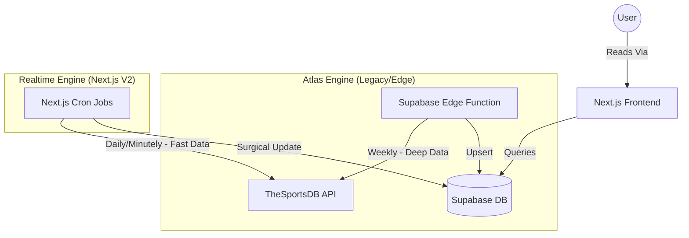
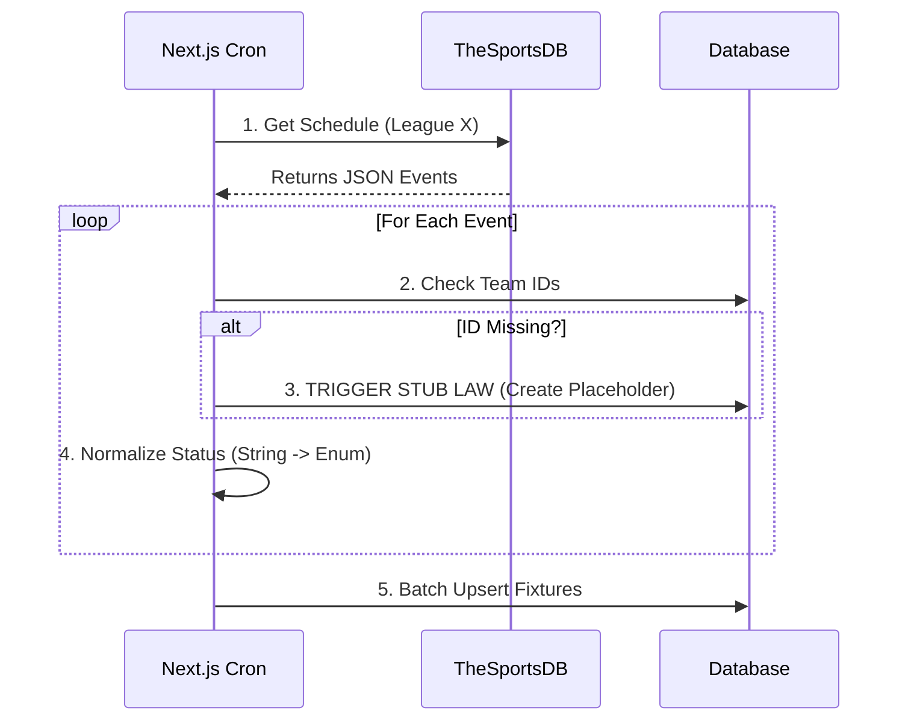
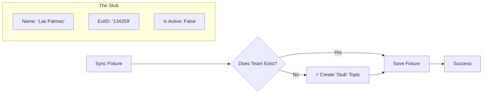
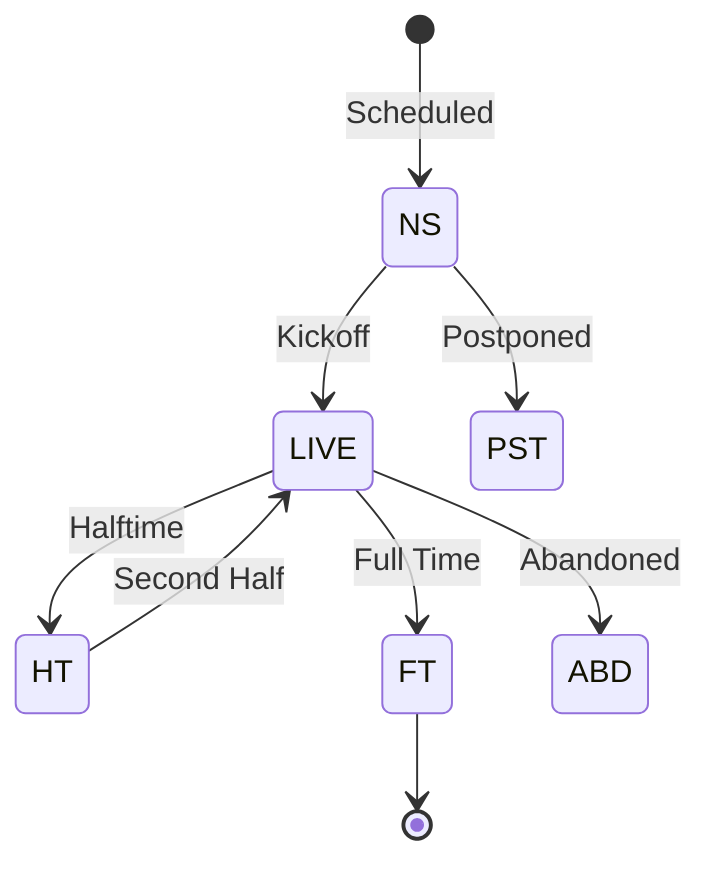

# Global Sync Architecture: The "Realtime & Atlas" Model
**Version 2.0 — Visual Mental Model**

## 1. The Philosophy: Speed vs. Depth

The core challenge of the Midfield architecture is managing two conflicting needs:
1.  **Speed**: Users need to see live scores *now*. Matches change state every minute.
2.  **Depth**: Users want deep stats, player histories, and transfer data, which is heavy and static.

To solve this, we split the system into two distinct "Engines" that run in parallel but never conflict.

### High-Level System View

---

## 2. The Realtime Engine (V2)
**"The Surgical Striker"**

The Realtime Engine is built on Next.js Server Actions and automation. It is designed to be lightweight, fail-safe, and fast. It owns **Time**.

### Responsibility
*   **Schedule**: Knowing when matches happen.
*   **State**: Knowing if a match is `LIVE`, `HT`, or `FT`.
*   **Scores**: Updating the scoreline.

### Workflow: The Daily Sync Loop
This process runs every morning to ensure the database has the latest schedule for the next few days.

---

## 3. The Immutable Laws

### Law I: The Stub Law (Visualized)
The most critical reliability feature. In a relational database, you usually can't create a Fixture if the Team doesn't exist. "The Stub Law" says: **Create the team instantly.**

*Why this matters*: It prevents the entire sync from crashing just because one newly promoted team is missing from our database. The **Atlas Engine** will come by later and fill in the details (Logo, Players, Stadium) for this Stub.

### Law II: Strict Status Enums
We strictly enforce match states to keep the frontend logic clean.

*   **NS**: Not Started
*   **LIVE**: Active (includes stoppage time)
*   **HT**: Halftime break
*   **FT**: Full Time (Final)
*   **PST**: Postponed/Cancelled
*   **ABD**: Abandoned

---

## 4. The Atlas Engine (Legacy)
**"The Heavy Basic"**

The Atlas Engine runs on Supabase Edge Functions. It is allowed to take a long time to run. It owns **Structure**.

### Responsibility
*   **Entities**: Creating the rich profile for Clubs and Players.
*   **Relationships**: Linking Players to Clubs (Transfers).
*   **Images**: Fetching and storing logos/photos.
*   **SoFIFA**: Importing FC26 rating data.

*Note: The Atlas Engine is explicitly forbidden from touching the `fixtures` table to prevent double-write conflicts.*

---

---

## 5. Master Schedule & Frequency Map

This is the heartbeat of the entire system.

### A. The "Atlas" Cycle (Structure)
**Frequency**: Weekly (Sunday Nights at 02:00 UTC)
**Executor**: `supabase/functions/sync-worker`

1.  **League Sync**:
    *   Fetches list of all leagues.
    *   Updates logos, trophys, and country data.
2.  **Club Sync**:
    *   Fetches all teams for each league.
    *   Updates badges, stadiums, and foundation years.
    *   *Self-Healing*: If a "Stub" exists, this process fills it with real data.
3.  **Player Sync**:
    *   Fetches squad lists.
    *   Updates photos (cutouts), positions, and nationalities.
    *   Creates "Plays For" relationships (Transfers).
4.  **Standings Sync**:
    *   Updates the `league_standings` table.
    *   Calculates Points, W/D/L, and Form.

### B. The "Realtime" Cycle (Time)
**Frequency**: Daily (09:00 UTC)
**Executor**: `simple-fixture-sync.ts` (Next.js Cron)

1.  **Schedule Sync**:
    *   Fetches the next 30 days of matches.
    *   Fetches the last 7 days of results.
    *   **Stub Check**: Auto-creates missing teams immediately.
    *   **Normalization**: Converts API status strings to `NS`/`FT`.
    *   **Writes**: Upserts to `fixtures` table.

### C. The "Live" Cycle (Action)
**Frequency**: Every 60 seconds (During Match Windows)
**Executor**: `simple-fixture-sync.ts` (Next.js Cron)

1.  **Active Poll**:
    *   Asks: "Are there any matches with status `LIVE` or `HT` right now?"
    *   If NO: Sleep.
    *   If YES: Poll API for those specific Match IDs.
2.  **Score Update**:
    *   Updates `home_score` and `away_score`.
    *   Updates `minute` (if available).
3.  **State Change**:
    *   `NS` -> `LIVE` (Kickoff).
    *   `LIVE` -> `HT` (Half time).
    *   `HT` -> `LIVE` (Second half).
    *   `LIVE` -> `FT` (Final Whistle - Stop Polling).

---

## 6. Failure Modes & Recovery

| Scenario | System Reaction | Manual Fix Needed? |
| :--- | :--- | :--- |
| **Missing Team ID** | **Realtime Engine** creates a Stub. Sync continues. | No. |
| **API Down (V2)** | Sync skips. Retries next cron run. | No. |
| **Legacy Worker Crash** | Atlas data becomes stale (1 week). Realtime Schedule keeps working independently. | No (unless perma-crash). |
| **Wrong Score** | Realtime Engine self-corrects on next minute poll. | No. |

## 7. Data Storage Limits
*   **Images**: Non-existent in DB. We store URL strings only.
*   **JSON Blobs**: Used for `fc26_data` (Ratings) to avoid 100+ separate columns.
*   **History**: We do not delete old fixtures. We rely on Partitions (future optimization) if table exceeds 1M rows.

